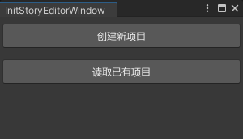
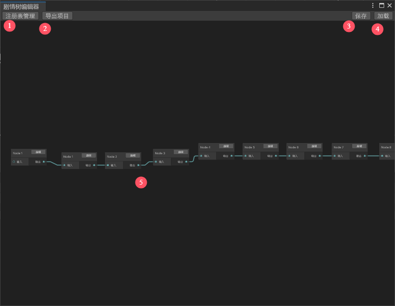
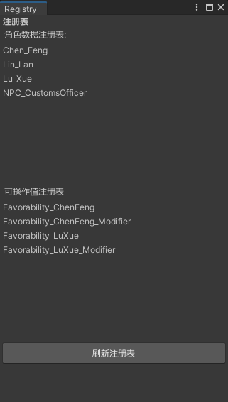
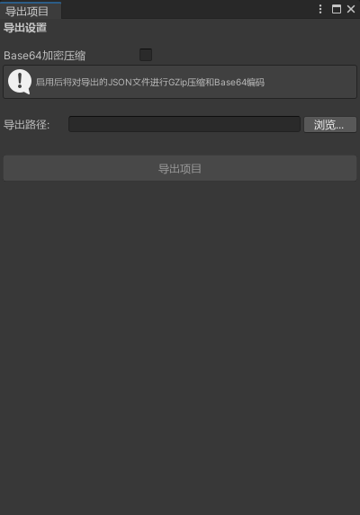

# 概念术语：

Story Project - 故事/剧情项目，Rift自研Unity剧情树编辑器导出的文件，通常为json文件或.story格式的二进制文件。Rift的主线剧情由多个Story Project组成。
Character - 角色数据，一种基于SO文件的由剧情树编辑器统一管理的角色数据文件，记录出现在剧情中的角色信息（名称，肖像等）
Operation Value - 操作值数据，一种基于SO文件的由剧情树编辑器统一管理的可操作值数据文件，用于记录剧情中的数值变化（如角色好感度等）
Story Global Registry - 记录需要导出到项目文件中的角色数据和操作值数据的注册表，在编辑器窗口中可以打开注册表管理窗口。Rift中所有的Story Project共用同一份Registry和同一套角色/操作值，故称之为全局注册表
# 使用方法：

## 打开窗口：

Tools/Story Editor Window 可以打开剧情树初始化窗口，两个按钮选择新建项目或加载已有项目。

如果选择新建项目，会在路径Assets/Configs/StoryProjects下生成注册表和对应的项目文件。并在路径Assets/Configs/GraphData生成对应的记录图表信息的文件。（注意：通常GraphData文件不需要手动修改更新，请谨慎操作）
如果选择读取已有项目，需要去路径Assets/Configs/StoryProjects/ProjectData下选择对应的项目asset文件，工具会自动解析并显示窗口
窗口示例如下：

## 主操作窗口

参考上图中的序号
1. 注册表管理按钮，点击后打开注册表管理窗口，用于刷新操作值和角色的注册表。如果新增或删除了操作值和角色，下次导出项目之前需手动更新注册表。
2. 导出项目按钮，点击后打开导出项目窗口，用于导出项目
3. 保存按钮，点击后保存项目节点信息和图表信息
4. 加载按钮，同初始化窗口中的读取项目，点击后手动前往Assets/Configs/StoryProjects/ProjectData选择新的Story Project asset项目文件
5. 操作区，右键 - 新建节点，创建新的节点。每个节点都有对应的节点SO文件，点击节点上的编辑按钮即可在Inspector面板中自动选中对应的SO文件，然后即可编辑对应的SO文件并保存。
## 注册表管理窗口

该页面相对简单，打开后会显示对应路径下已注册的角色数据和操作值数据每点击刷新注册表即可刷新。
## 导出窗口

完成项目编辑后可在该页面对项目进行导出，勾选Base64加密压缩后会导出.story格式的二进制文件，不勾选默认输出json文件，可根据需要勾选。